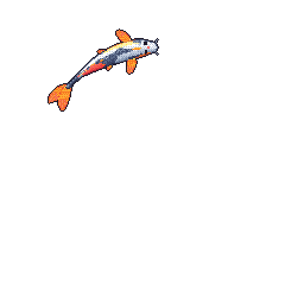

  <!-- Top Corner Coding Animation -->
  

  <!-- Venom Header (SVG + CSS Keyframe Animation) -->
  

 

<!-- Interactive 3D GitHub Activity Card (Isometric Terrain + Radar + Languages + KPIs) -->

  

<!-- Living Activity Koi (Self-Hosted Database) -->

  
   
  <em>Living activity koi roaming the mainframe landscape. Scale patterns encode public streaks, colors reflect repository languages, and daily motion tracks GitHub rhythm. Self-hosted database in <a href="koi/">Scrooge-777/koi</a>.</em>

 

<!-- Projects -->
<h2 align="center">Projects</h2>
 

| Project | What it is | Stack | Status |
| --- | --- | --- | --- |
| [aeon](https://github.com/Scrooge-777/aeon) | Capability-based x86_64 microkernel: UEFI 2.10 bootloader, 4-level paging (CR3), APIC timer interrupts, isolated driver servers. | Rust (no_std), Assembly | Active |
| [syntra](https://github.com/Scrooge-777/syntra) | Deterministic Windows study OS: 9-state state machine, low-level Win32 keyboard hook, active quiz gatekeeper (80% barrier). | C# .NET 8, Win32, SQLite | Active (Milestones 1-5) |
| [omni](https://github.com/Scrooge-777/omni) | Windows laptop telemetry dashboard: live CPU/GPU/battery/fans/watts, RAM map, internet speed test, benchmarks and safe power tuning. | Python, JavaScript, HTML, CSS | Active |
| [tabroost](https://github.com/Scrooge-777/tabroost) | Edge-style workspaces for Brave and Chrome (Manifest V3). One window per project, saved tabs and tab groups, instant switching. | JavaScript, HTML, CSS | Released (v1.2.0) |
| [voxexpress-eval](https://github.com/Scrooge-777/voxexpress-eval) | Automated objective evaluation benchmark for multilingual and expressive speech synthesis. | Python, Docker | Active |

 

<!-- Minimal Core Arsenal -->
<h2 align="center">Core Arsenal</h2>
 

  

 

  <!-- Venom Footer (SVG + CSS Wave Animation) -->
  

